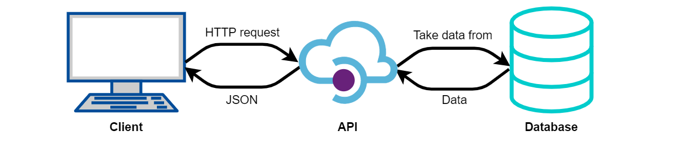

# RESTful API for social media sites

This repository consists of 2 RESTful API.
They both use Python and Django.

By using the RESTful API, we can easily CREATE, READ, UPDATE, DELETE(CRUD) records of the feed in social media in the database we used.
We can access the data in a good way where we are able to handle multiple calls. Client can get the data conveniently by obtaining JSON format data from our server.

The environment file (environment.yml) is included in the source file.

## Architecture diagram of the RESTful API

 
